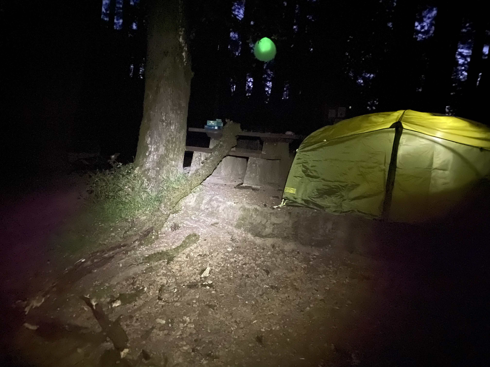

<h1 align="center">Hello World - My #100DaysOfCode Story</h1>

___

## Hello world

I'm Alex, h e l l o. See that purple glory? The unpacked monitors? The mic stand, the RedBull (not glorifying this awful habit), the water (to feel less bad about the RedBull), and the headphones?

This is my workspace. 

Like many in this WFH world, I've emerged from bed every day to gently place my caboose in a chair and interact with the world almost exclusively through those screens. I don't code for a living...yet.

For context, early on in 2020 I took FCC's frontend certs and fell in love with programming - the endless learning, possibilities, and problem solving of it all. I used to do math on Khan Academy in the off hours, but coding quickly filled that position - it was what I did to blow off steam at day's end. 

The more time I spent in front of those screens interacting with the digital world, the more I wanted to *build* bits of the internet and play an active role in developing it.

Again, like many of us, life sent no shortage of obstacles my way in recent years. This forced me to take a hiatus from coding. After rallying in 2022, I decided to come back in full effect with this schedule:

### 8am - 4pm 

freelance as a paid social media marketer

optimize ads across facebook, pinterest, instagram, tiktok, and snapchat 

work with cool people at a cool agency

be grateful for the opportunity, but prefer to code (sigh)

### 4pm - 630pm

exercise

skate 

dread the potential of nuclear war 

dine 

coffee 

wish I already knew what I need to get hired 

hope coffee helps me focus 

have a lot of ~ *thoughts* ~

regret drinking coffee late in the day

etc...

*takes a deep breath* 

### 630pm to 1030pm (sometimes later)

*try* to self-teach js and frontend dev with lots of help from friends and the internet

### Fast forward to today (1 March 2022)

In late February, even with the support of a close friend and mentor, I felt hesitant - there was too much ground to make up. I started rationalizing: what if the thrill of automating marketing tasks with Python was enough? Then it happened...

On Valentine's Day, a Douglass Fir in Mt. Tamalpais dropped a tree-sized limb (see photo above) that nearly crushed my girlfriend and me to death. The sound was so loud I immediately jolted awake to find the branch just a few feet from my tent. I didn't know how to feel: shocked, relieved, concerned? All of it hit me.

Once reality pulled into focus, I realized this near-death experience had reset my perspective almost instantly. It reminded me that there's no sense in waiting for the "perfect" time, the time to commit is now.

I decided to take a chance - to leave my full-time role and pursue a career as a software engineer. 

### "Hello World"...again!

My last day is 3.14.22 (pi day, woot). While I'll miss my team and the incredible people I got to work with, I'd regret not putting everything I have into this.

I came across the #100DaysOfCode recently - hard to miss when you're connected to FCC's community. After a dive into the site and seeing how active the community is, it was a no-brainer. 

As of 1 March 2022, I'm comitted to the rules. As of 3.14, I'm committed to coding and applying to jobs full-time with the 'reach' goal of getting hired by the end of 100 days.

With tempered expecations, I'm excited to: 

- connect with and support challengers
- join a community 
- get/give mentorship 
- and - if I learn enough to be valuable to someone's business - attain the holy grail: a career solving problems with computers.

Not sure if anyone will ever lay eyes on this, but if it helps you, catches your attention, inspires you, makes you cringe, or anything in between - reach out to me and tell me about it.

[Twitter](https://twitter.com/alexjazayeri)

[LinkedIn](https://www.linkedin.com/in/alex-ownejazayeri/)

[GitHub](https://github.com/alexownejazayeri)

Constructive feedback, commiseration, and comments welcome. Let's do the thing!

## Contents
* [Rules](rules.md)
* [Log - click here to see my progress](log.md)
* [README](README.md)
